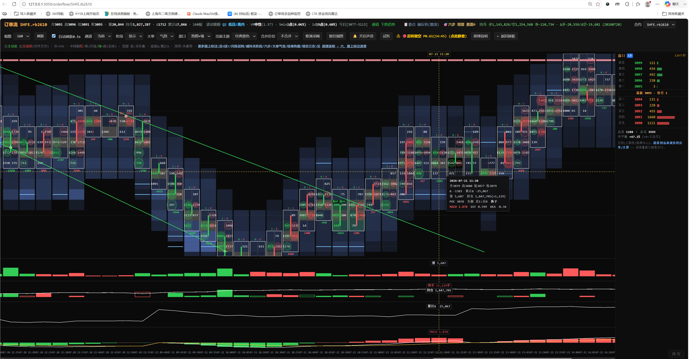
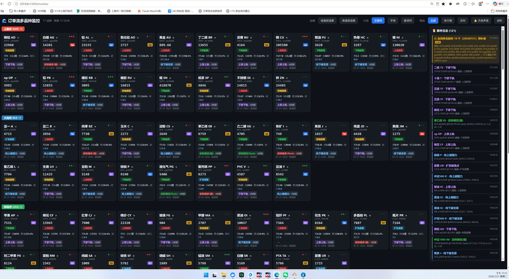
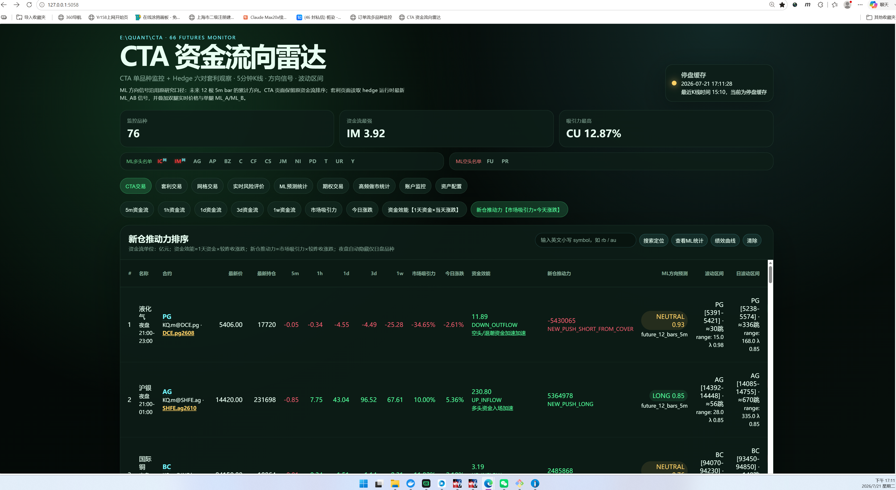
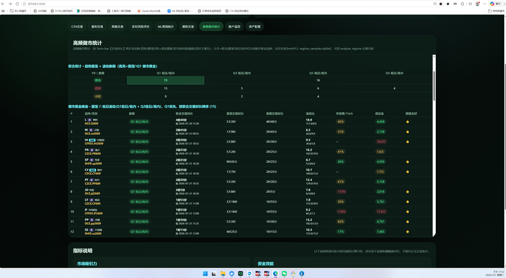

清华大学出版社签约，《AI驱动下的高频因子挖掘》图书配套相关代码 这里发布最新的勘误和后续配套的代码和本书相关衍生的量化策略；需要ppt和答疑请联系，作者邮箱：jianwu790626@gmail.com 相关视频请查看B站 高频交易dragon，
ppt与code百度网盘备份下载：永久有效，欢迎转发！
链接: https://pan.baidu.com/s/1Tq8NpkG3cKJoehbKWgjVWQ?pwd=hmt2 提取码: hmt2

后续工作：
1,搭建期货主力连续合约tick数据共享平台；
2，搭建AI自动挖掘截面因子平台，可共享；
3，搭建网站分享订单流，大威量龙操盘法；先放一些图片在gitbub，从作者购买图书的兄弟使用免费2周！
4，应用双动量在ETF/期货+大威量龙操盘法做CTA策略；
5，应用截面因子选期+大威量龙操盘法+波动率预测+库存管理  做高频grid；

订单流软件展示：

订单流多品种截面监控：

期货资金流向雷达:

高频做市品种统计：

欢迎有网站前后台能力的兄弟一起研发: 把因子挖掘平台+订单流网站共享出来;
